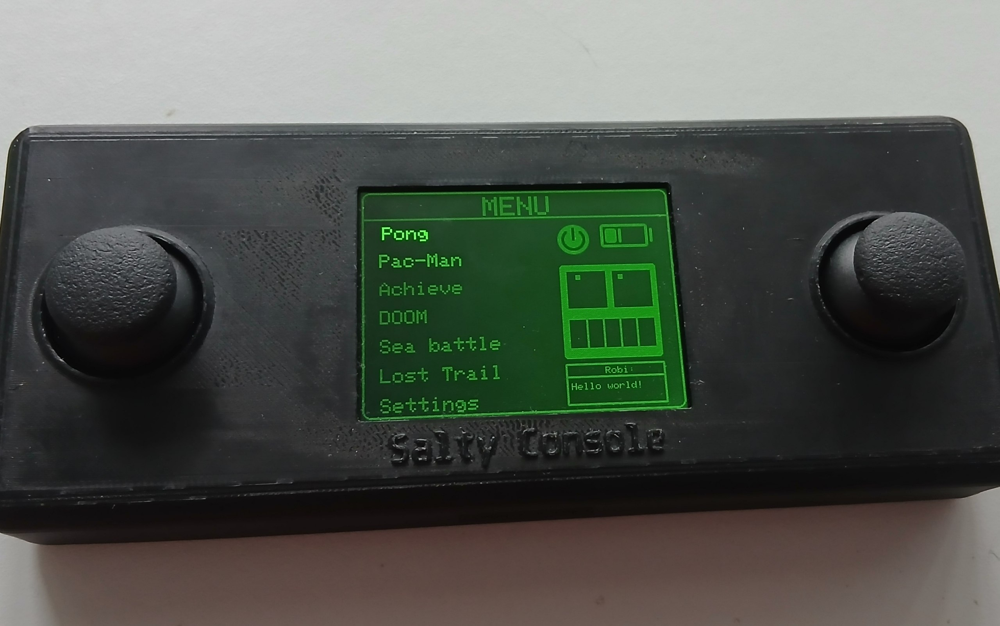
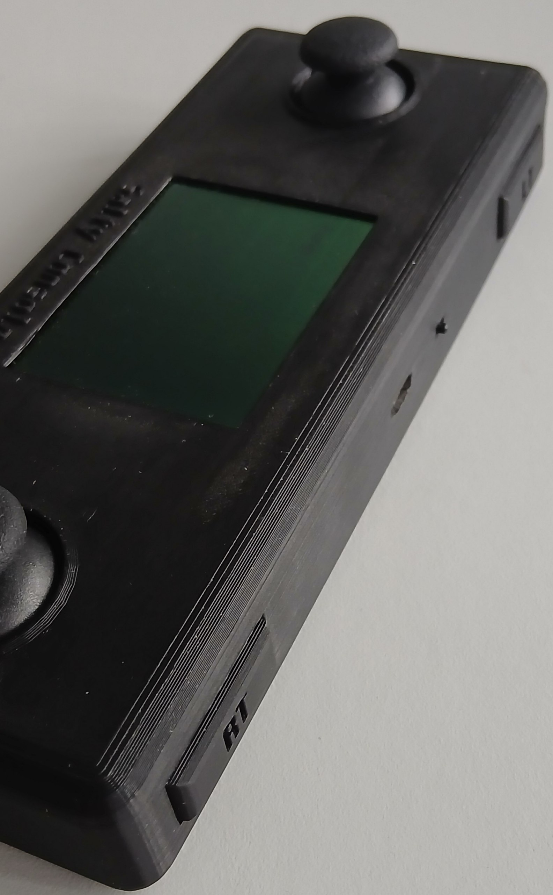
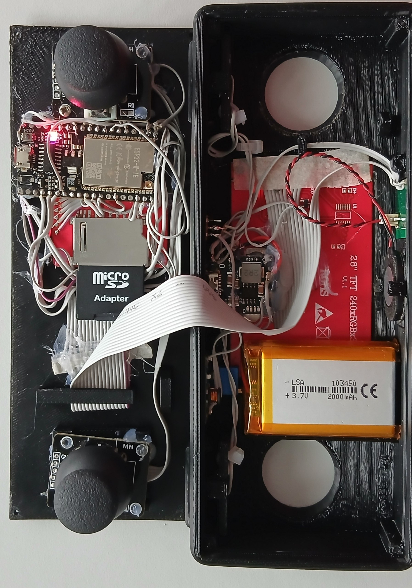
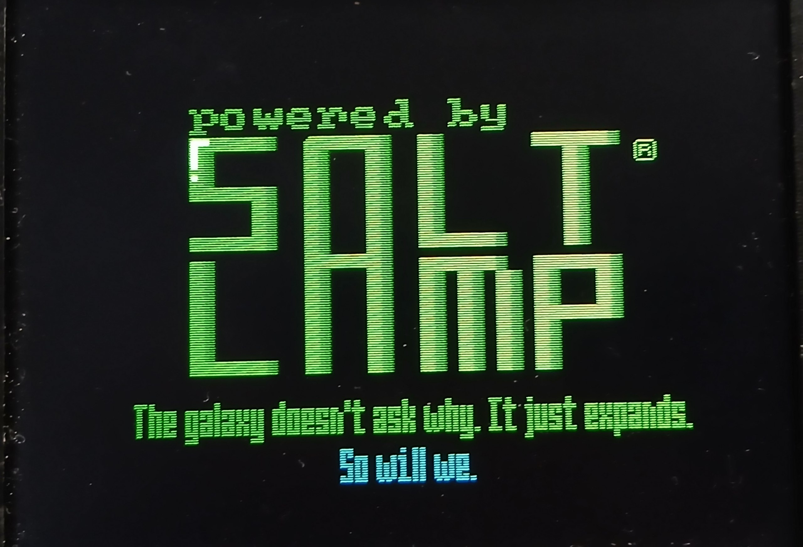
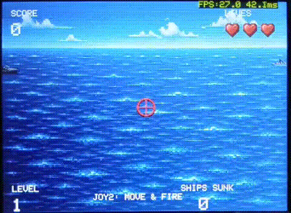

# 🎮 Salty Console

> Портативная игровая консоль на базе ESP32 с системой достижений, аудио и несколькими встроенными играми.


---




---
## Progress

- [x] Menu
- [x] Pong
- [x] Audio
- [ ] Wi-Fi
- [ ] Система аккаунтов
---
# 📌 О проекте

**Salty Console** — это кастомная игровая консоль, разработанная на ESP32 с использованием библиотеки TFT_eSPI и Arduino Framework.
---
## Примеры геймплея
# Pong

# Морской бой

---
Проект включает:

- полноценное графическое меню;
- несколько встроенных игр;
- систему достижений;
- аудио;
- анимации;
- поддержку SD-карты;
- работу со спрайтами;
- систему FPS.

---

# ✨ Возможности

## 🕹 Встроенные игры

В проект уже входят:

- Pong
- Pacman
- Sea Battle
- Doom like
- Lost Trail (2D платформер)

Фичи:

- Режим снегопада (остался с новогоднего апдейта)
- Здоровый сон (esp_light_sleep_start)
- Возможность отключить показ FPS

---

## 🎨 Графическая система

- работа через `TFT_eSPI`
- спрайтовый рендеринг
- плавные анимации
- система переходов
- кастомные UI-компоненты

---

## 🔊 Аудио

- воспроизведение звуков
- глобальное управление звуком
- система аудио-состояний

---

## 🏆 Система достижений

- сохранение прогресса (к сожалению, не в энергонезависимой памяти)
- экран достижений
- уведомления о достижениях 

---

## ⚡ Производительность

- отображение FPS
- отдельные render/logic task
- оптимизация через спрайты
- кэширование текстур с SD

---

# 🧱 Структура проекта

```text
.
├── include/
│   ├── achievements.h
│   ├── audio_simple.h
│   ├── doom.h
│   ├── input.h
│   ├── intro.h
│   ├── lost_trail.h
│   ├── menu.h
│   ├── pacman.h
│   ├── pong.h
│   ├── seabattle.h
│   ├── shared.h
│   ├── sprite_loader.h
│   └── voltage.h
│
├── src/
│   ├── achievements.cpp
│   ├── audio_simple.cpp
│   ├── doom.cpp
│   ├── input.cpp
│   ├── intro.cpp
│   ├── lost_trail.cpp
│   ├── main.cpp
│   ├── menu.cpp
│   ├── pacman.cpp
│   ├── pong.cpp
│   ├── seabattle.cpp
│   ├── shared.cpp
│   ├── sprite_loader.cpp
│   └── voltage.cpp
```

---

# ⚙️ Требования

## Аппаратная часть

- ESP32
- TFT дисплей
- SD-карта
- джойстик и кнопки
- динамик (опционально)
- VS1053

---


# 🚀 Установка

## 1. Клонирование репозитория

```bash
git clone https://github.com/USERNAME/salty-console.git
```

---

## 2. Открыть проект

Откройте проект через:

- PlatformIO

или

- Arduino IDE

---

## 3. Установить библиотеки

Установите:

```text
TFT_eSPI
SD
SPI
Preferences
```

---

## 4. Настройка TFT_eSPI

Настройте файл:

```text
User_Setup.h
```

Под параметры вашего дисплея.

---

## 5. Сборка

```bash
pio run
```

---

## 6. Прошивка

```bash
pio run --target upload
```

---

# 🎮 Управление

| Действие | Управление |
|---|---|
| Передвижение | Джойстик |
| Выбор | Кнопка |
| Назад | BACK |
| Пауза | START |

---

# 🧠 Архитектура

Проект использует:

- систему игровых состояний (`GameState`)
- разделение логики и рендера
- централизованный shared state
- менеджер анимаций
- менеджер цветовых эффектов
- спрайтовую систему

Основные состояния:

```cpp
enum GameState {
    MENU,
    PONG,
    PACMAN,
    ACHIEVEMENTS_SCREEN,
    DOOM,
    SEABATTLE,
    LOST_TRAIL,
    SETTINGS
};
```

---

# 📈 Планы

- [ ] OTA обновления
- [ ] Новые игры
- [ ] Система сохранений
- [ ] Файловый менеджер
- [ ] Система аккаунтов
- [ ] Отображения заряда аккумулятора

---

# 🤝 Контрибьютинг

Pull Requests приветствуются.

---

# 📄 Лицензия

MIT License

---

# 👨‍💻 Автор

**Salty Console Project**

Разработано с ❤️ на ESP32.

# Немного о проделанном
> *Мой проект предостовляет огромное количество функций, которые могли бы отлично помочь при разработке чего-то большего)))
> В моих 9к строк кода есть очень неплохие функции для анимаций (в том числе и цветовых анимаций);
> система для управления звуком в отдельной задаче;
> чтение и запись в оперативную память с SD карты текстур, сохраненных в .raw, с помощью пары вызовов функций;
> прекрасный shared для глобального доступа ко всем файлам консоли;
> файл input позволяет легко обращаться к состояниям джойстиков и кнопок;
> к сожалению мне не удалось реализовать достаточно много функций, которые я задумывал, одна из них: отображение в меню уровня заряда акб
> (у esp32 очень полохой ADC и с помощью делителя напряжения измерить заряд акб становится очень сложным).
> Salty Console появилась спустя 1,5 года неспешной разработки. 
> Я буду очень рад если хотя бы один человек захочет повторить мой проект или что-то доработать.*

```Version 2.5.14, but this is just the beginning...```
